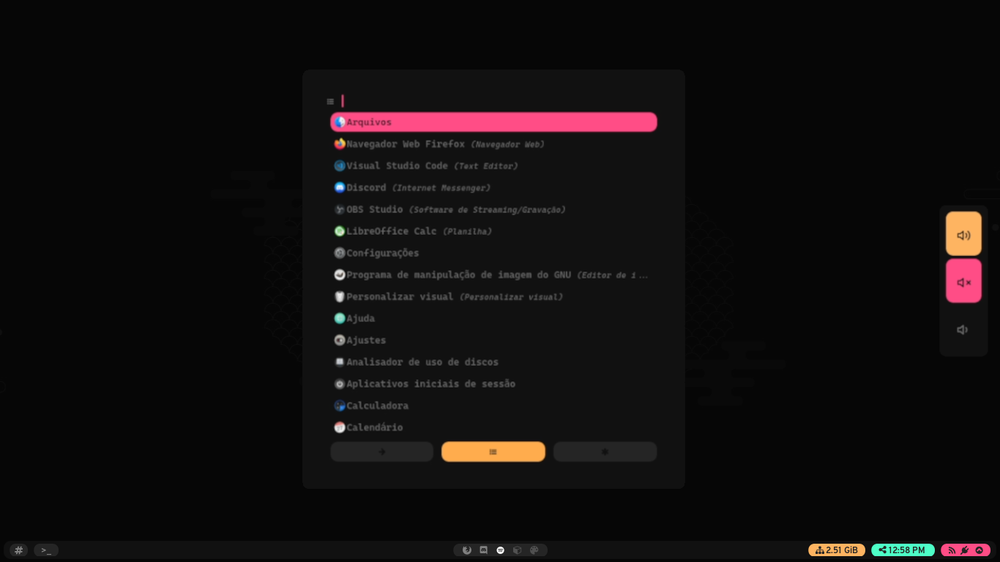

<h1 align="center">👁️</h1>

## 🧠 Setup

- os: [Pop-os](https://pop.system76.com/)
- wm: [Bspwm](https://github.com/baskerville/bspwm)
- bar: [Polybar](https://github.com/polybar/polybar)
- compositor: [Picom](https://github.com/yshui/picom)
- launcher: [Rofi](https://github.com/davatorium/rofi)
- ...
- ..
- .

## 💻 Keybinds

- Launcher:    `Super + d`
- Volume:      `Super + v`
- Print:       `PrtSc (print_screen)`
- Powermenu:   `Super + k` 
- Quick_Links: `Super + q`